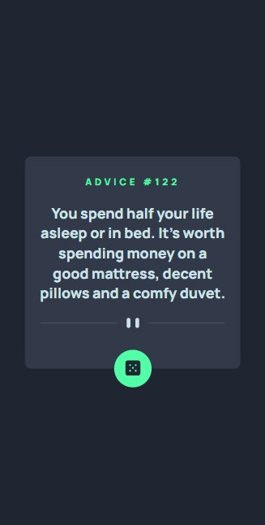
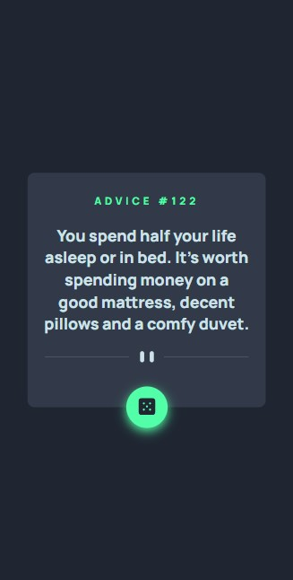
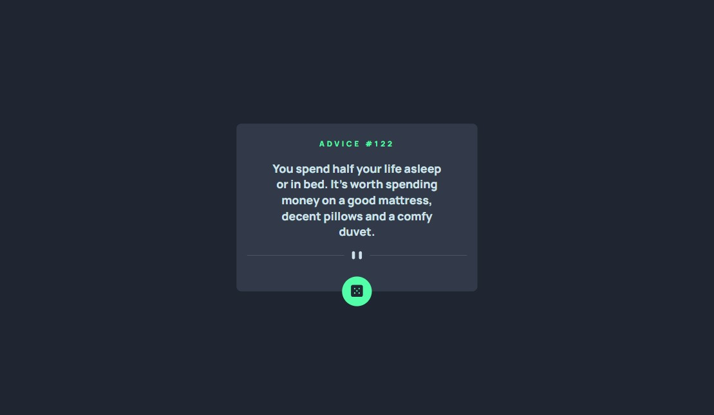
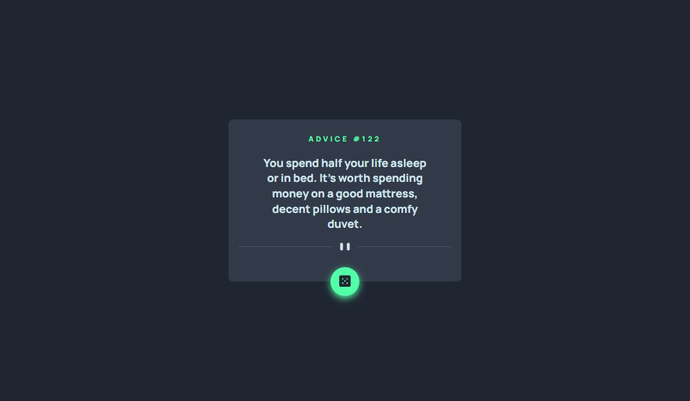
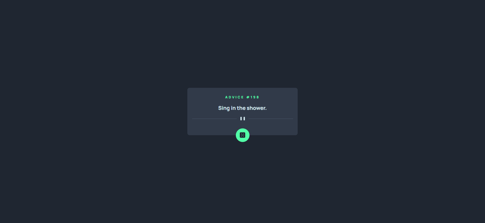

# Frontend Mentor - Advice generator app solution

This is a solution to the [Advice generator app challenge on Frontend Mentor](https://www.frontendmentor.io/challenges/advice-generator-app-QdUG-13db). Frontend Mentor challenges help you improve your coding skills by building realistic projects.

## Table of contents

- [Overview](#overview)
  - [The challenge](#the-challenge)
  - [Screenshot](#screenshot)
  - [Links](#links)
- [My process](#my-process)
  - [Built with](#built-with)
  - [What I learned](#what-i-learned)
- [Author](#author)

# Overview

### The challenge

Users should be able to:

- View the optimal layout for the app depending on their device's screen size
- See hover states for all interactive elements on the page
- Generate a new piece of advice by clicking the dice icon

### Screenshot

These are screenshots of the project in the initial state and the active state, where all the hovers are activated.

#### Mobile Preview

#### Desktop Preview

This is a preview of the application running.
#### Running Preview

### Links

- Solution URL: [Add solution URL here](https://your-solution-url.com)
- Live Site URL: [Add live site URL here](https://your-live-site-url.com)

## My process

### Built with

- HTML
- CSS
- JavaScript
- [Advice Slip JSON API](https://api.adviceslip.com/)

### What I learned

In this project I could put my recent knowledge of working with APIs into practice, I am very proud that I managed to solve this challenge quickly.

## Author

- GitHub - [guisalva](https://github.com/guisalva)
- Frontend Mentor - [@guisalva](https://www.frontendmentor.io/profile/guisalva)
- LinkedIn - [Guilherme Salvador](https://www.linkedin.com/in/guisalva)